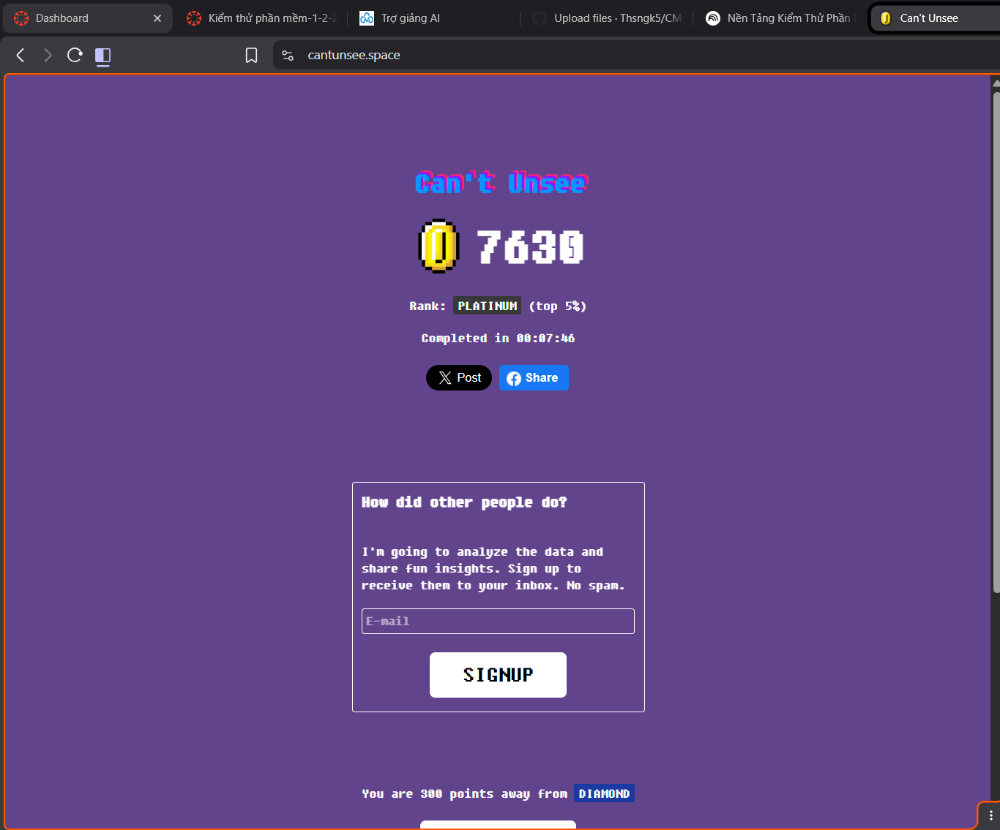

# Bài 1: Can't Unsee's Score



# Bài 2: Bài tập thực hành kiểm thử với JUnit

## 1. Mô tả bài toán

Xây dựng chương trình Java để phân tích dữ liệu điểm số học sinh, bao gồm:

* Đếm số học sinh đạt loại **Giỏi** (điểm >= 8.0)
* Tính **điểm trung bình** của các điểm hợp lệ (từ 0 đến 10)

Các điểm không hợp lệ (nhỏ hơn 0 hoặc lớn hơn 10) sẽ bị bỏ qua.
Nếu danh sách điểm rỗng hoặc không có điểm hợp lệ, kết quả trả về là `0`.

---

## 2. Công nghệ sử dụng

* **Ngôn ngữ:** Java
* **Kiểm thử:** JUnit 5 (JUnit Jupiter)
* **IDE:** Visual Studio Code
* **Quản lý thư viện:** Maven
* **Quản lý mã nguồn:** GitHub

---

## 3. Cấu trúc thư mục

```
unit-test/
├── src/
│   ├── main/
│   │   └── java/
│   │       └── StudentAnalyzer.java
│   └── test/
│       └── java/
│           └── StudentAnalyzerTest.java
├── pom.xml
└── README.md
```

---

## 4. Nội dung chính

### 4.1. Lớp `StudentAnalyzer`

Chứa hai phương thức:

* `countExcellentStudents(List<Double> scores)`
* `calculateValidAverage(List<Double> scores)`

Hai phương thức đều kiểm tra dữ liệu đầu vào và chỉ xử lý các điểm hợp lệ.

### 4.2. Lớp kiểm thử `StudentAnalyzerTest`

Bao gồm các test case cho:

* Trường hợp bình thường
* Trường hợp biên (0, 10, danh sách rỗng)
* Trường hợp dữ liệu không hợp lệ (<0, >10)

---

## 5. Hướng dẫn chạy kiểm thử đơn vị

### Cách 1: Chạy bằng VS Code

1. Cài đặt **Extension Pack for Java**
2. Mở file `StudentAnalyzerTest.java`
3. Nhấn **Run Test** phía trên mỗi phương thức test hoặc trên lớp test

### Cách 2: Chạy bằng Terminal

Tại thư mục project, chạy lệnh:

```bash
mvn test
```

---

## 6. Quản lý công việc với GitHub Issues

Project được chia thành các Issues:

1. Viết hàm `countExcellentStudents()`
2. Viết hàm `calculateValidAverage()`
3. Viết kiểm thử đơn vị cho hai hàm
4. Viết tài liệu README

Mỗi issue được thực hiện và commit riêng biệt, giúp dễ theo dõi tiến độ và lịch sử thay đổi.


* Cài đặt và sử dụng JUnit 5 để kiểm thử tự động
* Viết test case cho nhiều trường hợp khác nhau
* Áp dụng GitHub Issues và commit message đúng chuẩn
* Hiểu rõ hơn về vai trò của kiểm thử đơn vị trong phát triển phần mềm

